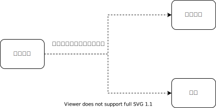

# 离散型流程

例如在订单成交之后，给中介分佣这一类的业务。它们有三个特点

* 不需要返回值。也就是只需要在时间顺序上，安排在之后发生。
* 不精确要求立即执行。稍微晚个几秒是可以忍受的。
* 不影响事务结果。不因为分佣服务挂了，导致订单无法成交。



## 事件驱动

订单的 Git 仓库提供 OrderCreated 事件。
分佣的 Git 仓库依赖订单 Git 仓库，订阅 OrderCreated 事件，在收到事件之后分佣金。

订单不能感知到分佣是否成功，也不能在下单成功的界面上立即展示出分佣的数据。
分佣也无法保证一定是在订单创建之后被立即触发执行的，消息队列仅保证最终会把消息投递出去。

## 可降级为事件驱动

很多流程需求夹杂了UI的需求，无法变成纯事件驱动的。

例如在结束订单的时候，要立即终止计费进程，并显示出账单。如果纯事件驱动的话，界面上的账单数据是拿不到的。
但是有可能计费进程这个时候异常，可以先在订单上标记好结束时间。
然后界面上显示“出账中，请耐心等待”。等计费进程恢复之后，再异步结账扣费。

这种类型的业务是订单的Git仓库依赖计费的Git仓库，而不是像上面的分佣业务那样，依赖是倒置的。

这种实现的伪代码是：

```ts
try {
    const newUI = finishBilling();
    renderUI(newUI);
} catch(e) {
    enqueueFinishBilling();
    renderUI('出账中，请耐心等待')
}
```

## 界面重刷新

上一种实现方式里，finishBilling 同时完成了两件事情

* 告诉订单结束，我这里搞完了，没问题
* 同时返回了账单

渲染账单的逻辑可能是经常易变的，导致 finishBilling 的接口稳定不下来。
可以把这两个操作分为两步：

```ts
try {
    finishBilling();
    refreshUI();
} catch(e) {
    enqueueFinishBilling();
    renderUI('出账中，请耐心等待')
}
```

这样，finishBilling 就可以仅仅专注于流程，而不用管 UI 需求。UI 逻辑可以使用离散型 UI 里的各种模式集成进来。

## 小结

在可能的情况下，纯事件驱动当然是 Autonomy 最佳的方案。奈何产品经理不喜欢异步。
最好不要在流程代码的接口里包含 UI，这样会使得接口更易变，也就更易于产生额外的沟通成本。
最好把 UI 需求按照离散型 UI 里描述的集成方式，用更 Autonomy 的方案集成进来。